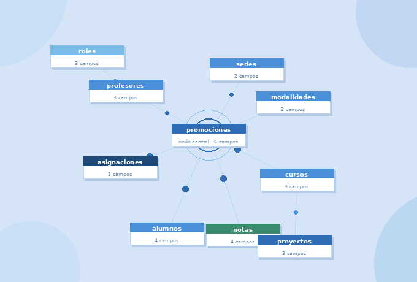

<div align="center">
<br>



<br><br>

<h1>Base de Datos Relacional · The Bridge</h1>

<p><strong>Ainara · Estibaliz · Iqra · Roberto</strong></p>

<br>

<a href="https://robertocantero82.github.io/base_datos_relacional_escuela/erd_interactivo.html">
  
</a>

<br><br>

</div>

---

## Descripción

A partir de un conjunto de datos sin normalizar sobre estudiantes y profesores de una escuela de bootcamps, el equipo diseñó e implementó una base de datos relacional completa en PostgreSQL. El objetivo fue adquirir experiencia práctica en modelado, normalización e ingesta de datos, así como en el despliegue de una base de datos accesible desde aplicaciones externas.

## Tecnologías


## Estructura del repositorio

```
├── archivos sql/      # Scripts de creación de tablas e ingesta
├── datos/             # Datos de entrada sin normalizar
├── memoria/           # Documentación del proceso
├── modelos/           # Diagramas E/R y modelo lógico
├── presentacion/      # Material de presentación final
├── erd.svg            # Diagrama E/R animado (hero del README)
└── Proyecto_BBDD.md   # Enunciado del proyecto
```

## Modelo de datos

| Tabla | Descripción | Relaciones |
|---|---|---|
| `promociones` | Núcleo del modelo — cada grupo de alumnos | → sedes, modalidades, cursos |
| `alumnos` | Estudiantes matriculados | → promociones |
| `profesores` | Docentes del bootcamp | → roles |
| `asignaciones` | Qué profesor imparte qué promoción | → profesores, promociones |
| `notas` | Resultados por alumno y proyecto | → alumnos, proyectos |
| `proyectos` | Entregas evaluables por curso | → cursos |
| `cursos` | Verticales del bootcamp (DS, FS…) | — |
| `roles` | Tipos de profesor (mentor, lead…) | — |
| `sedes` | Campus (Madrid, Valencia…) | — |
| `modalidades` | Presencial / online | — |

## Fases del proyecto

1. **Modelado E/R** — diseño de entidades, atributos y relaciones
2. **Modelo lógico** — definición de tablas, claves primarias y foráneas
3. **Despliegue en Render** — base de datos PostgreSQL alojada y accesible desde aplicaciones externas
4. **Normalización** — eliminación de redundancias e integridad de datos
5. **Creación e ingesta** — scripts SQL y carga de datos con Pandas
6. **Consultas** — queries de demostración sobre la base de datos funcional

## Escalabilidad

El diseño contempla el crecimiento en múltiples dimensiones: campus (Madrid, Valencia…), verticales (Data Science, Full Stack…), promociones, modalidades (presencial / online) y aulas.

## Equipo

<div align="center">
<br>

| &nbsp; | Nombre | Perfil |
|:---:|---|---|
| 🔵 | Ainara | Data Science / Full Stack |
| 🔵 | Estibaliz | Data Science / Full Stack |
| 🔵 | Iqra | Data Science / Full Stack |
| 🔵 | Roberto | Data Science / Full Stack |

<br>
<em>Ainara, Estibaliz, Iqra y Roberto colaboraron en todas las fases,<br>
desde el diseño inicial del modelo hasta la presentación final.</em>
<br><br>
</div>
